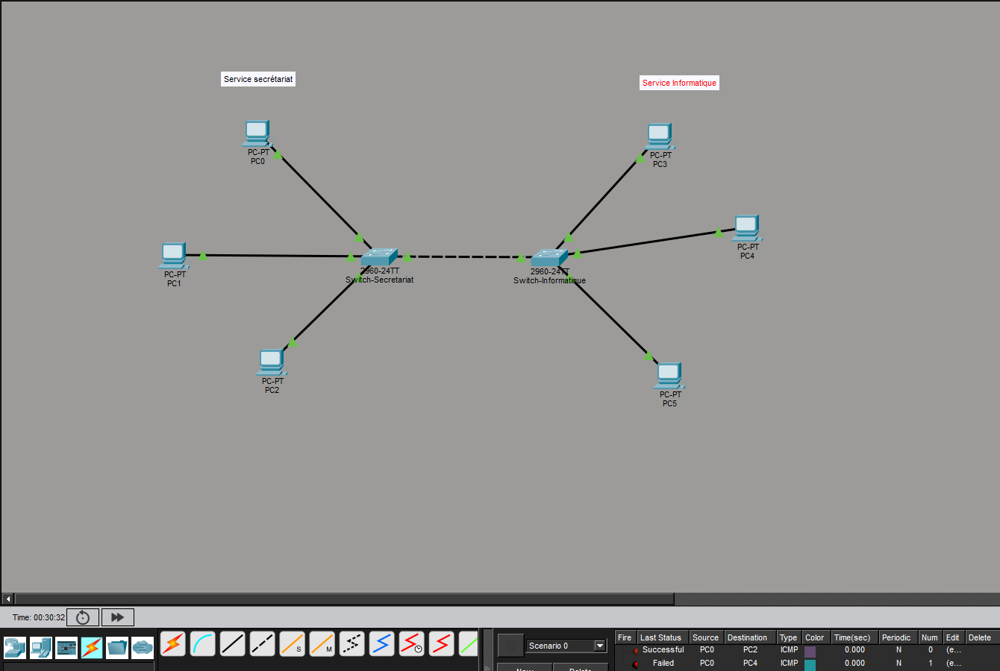
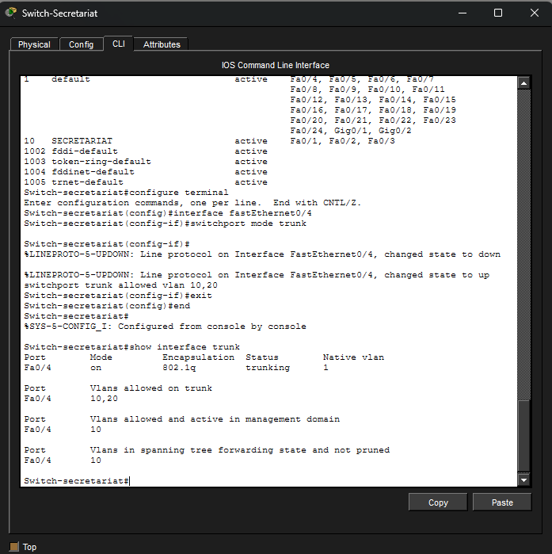
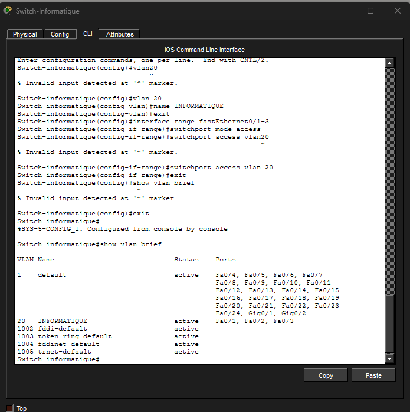
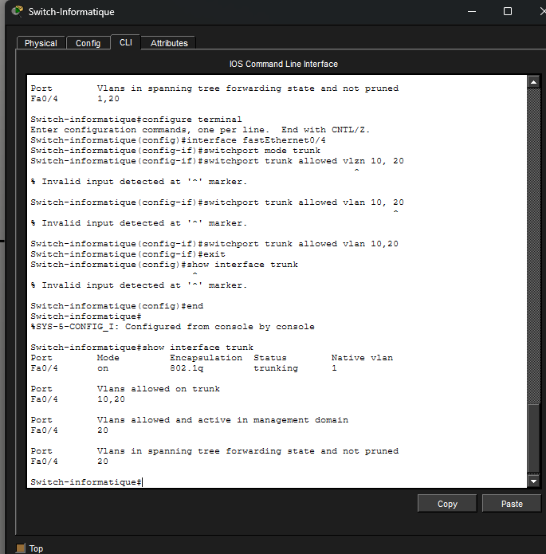

# Lab 01 — VLAN & Trunk : isolation Secrétariat / Informatique

> Premier lab en autonomie, réalisé une semaine après le début de ma formation TSSR en distanciel. Objectif : être à l'aise de A à Z sur la création de VLAN, l'adressage IP et la configuration d'un trunk entre deux switches Cisco (Packet Tracer).

## Contexte

Une entreprise fictive a deux services, Secrétariat et Informatique, tous deux sur le même réseau (192.168.1.0/24). L'objectif : créer un VLAN par service pour rendre toute communication entre eux impossible, même si les switches restent physiquement reliés.

## Topologie

- **Switch "Secrétariat"** : PC0, PC1, PC2 en accès VLAN 10 (Fa0/1 à Fa0/3)
- **Switch "Informatique"** : PC3, PC4, PC5 en accès VLAN 20 (Fa0/1 à Fa0/3)
- Lien inter-switch sur Fa0/4 des deux côtés, configuré en trunk (VLAN 10 et 20 autorisés)

## Ce que j'ai fait

1. Montage de la topologie et adressage IP des 6 postes
2. Vérification de la connectivité de base (tous les postes se pinguaient)
3. Création des VLAN 10 (SECRETARIAT) et 20 (INFORMATIQUE), assignation des ports en mode access
4. Vérification (`show vlan brief`)
5. Configuration du lien inter-switch en trunk, VLAN autorisés restreints à 10 et 20
6. Vérification du trunk (`show interfaces trunk`, `show cdp neighbors`)
7. Tests de ping : communication interne au service OK, communication entre services bloquée — y compris avec le trunk en place

## Résultats des tests

✅ PC0 ↔ PC1 ↔ PC2 (Secrétariat, VLAN 10) — communication OK
✅ PC3 ↔ PC4 ↔ PC5 (Informatique, VLAN 20) — communication OK
✅ PC0 ↔ PC3 (services différents) — bloqué, même avec le trunk actif

## Captures d'écran

**VLAN 10 (Secrétariat) et trunk vérifié**

**VLAN 20 (Informatique) créé et vérifié**

**Trunk vérifié côté Informatique**

## Ce que j'ai appris / points qui m'ont bloquée

- Un port en mode **trunk** transporte plusieurs VLAN sur un seul lien physique, mais ne casse pas l'étanchéité entre eux : chaque trame reste taguée avec son VLAN d'origine.
- `show cdp neighbors` est très utile pour vérifier objectivement quel port relie réellement les deux switches entre eux (le CDP ne fonctionne qu'entre équipements Cisco, jamais avec un PC) — pratique pour débusquer une erreur de câblage.
- Dans cette topologie, le trunk n'était pas strictement nécessaire pour l'isolation (chaque service est entièrement sur son propre switch) — il devient indispensable dès qu'un même VLAN doit exister sur plusieurs switches.
